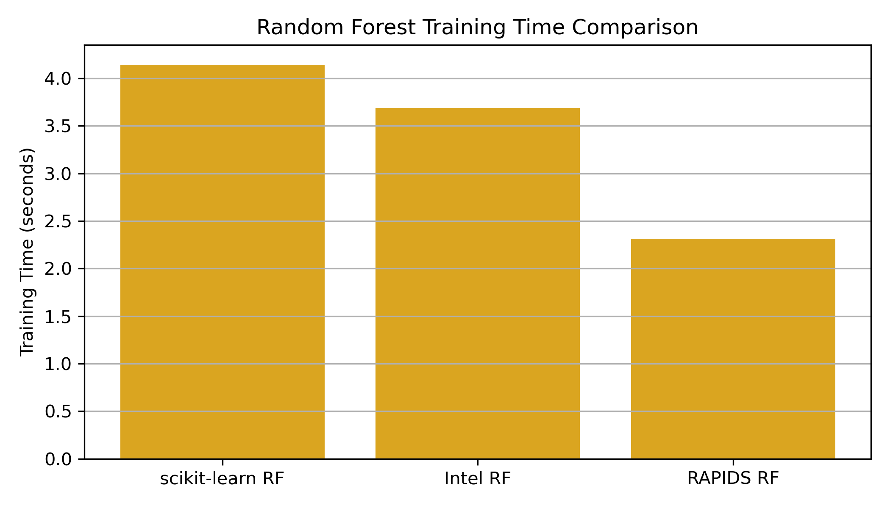
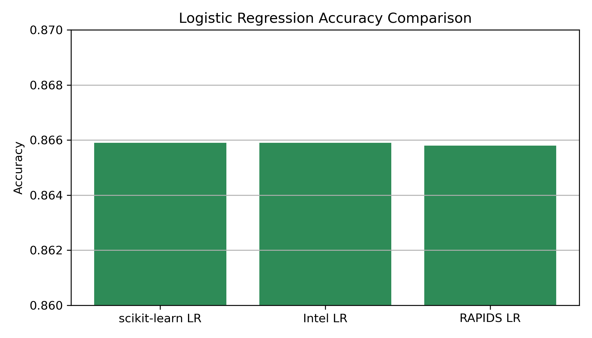

# Machine Learning Acceleration using Intel oneAPI and NVIDIA RAPIDS

## Code Repository

GitHub Link: [https://github.com/siddharthck/255-HW-2](https://github.com/siddharthck/255-HW-2) 

Service used : AWS Sagemaker AI 

This repository includes all code, comparisons, and setup scripts for SageMaker + RAPIDS + PyTorch environments.

## Introduction

The growing availability of hardware-accelerated machine learning (ML) frameworks has opened new avenues to enhance training performance without compromising accuracy. This report benchmarks and evaluates classical ML models across three platforms:

* Standard scikit-learn (CPU-based)
* Intel oneAPI acceleration using `scikit-learn-intelex`
* NVIDIA RAPIDS using `cuML` (GPU-based)

Additionally, a PyTorch-based neural network model was added to target an "excellent" rating.

All experiments were conducted on the CDC Diabetes Health Indicators Dataset, which contains over 250,000 patient records and includes binary classification labels for diabetes diagnosis.

## Problem Statement

Given a rich tabular dataset with both lifestyle and medical attributes, we aim to:

1. Train and benchmark ML classifiers on the same dataset and settings
2. Accelerate training with Intel oneAPI (CPU) and NVIDIA RAPIDS (GPU)
3. Compare the performance (accuracy and training time) across all platforms
4. Explore whether model complexity affects acceleration (Logistic Regression vs Random Forest)
5. Integrate a Neural Network (PyTorch) and compare its accuracy/speed

## Dataset Description

The dataset used in this project is the **CDC Diabetes Health Indicators Dataset**, available at the UCI Machine Learning Repository:
[https://archive.ics.uci.edu/dataset/891/cdc+diabetes+health+indicators](https://archive.ics.uci.edu/dataset/891/cdc+diabetes+health+indicators)

* Dataset: CDC Diabetes Health Indicators
* Records: 253,680
* Features: 21 (categorical + numerical)
* Target: `Diabetes_binary` (0 = No, 1 = Diabetic/Prediabetic)
* Preprocessing: Feature scaling via `StandardScaler`, train-test split (80-20)

## Target Distribution

```python
sns.countplot(x=df["Diabetes_binary"])
```

This confirms a reasonably balanced class distribution, making accuracy a reliable performance metric.


## Experimental Environment: Amazon SageMaker Setup

All models were executed in an Amazon SageMaker notebook instance using the following configuration:

* **Instance Type**: `ml.g4dn.xlarge`
* **CPU**: Intel Xeon
* **GPU**: NVIDIA T4 (16 GB)
* **Memory**: 16 GB RAM
* **CUDA Version**: 12.4
* **Hourly Cost**: Approximately \$0.65/hour (on-demand pricing)

### Software Environment

* Base kernel for scikit-learn and Intel oneAPI: `conda_pytorch_p310`
* Custom conda environment for RAPIDS created using:

  ```bash
  conda create -n rapids -c rapidsai -c nvidia -c conda-forge cuml=23.02 python=3.10 cudatoolkit=11.8
  ```
  Please see setup.sh in code repository.
* PyTorch and Intel oneAPI models were run in the default PyTorch environment.
* RAPIDS models were run in the `rapids` kernel, registered with Jupyter using `ipykernel`.

### Note on RAPIDS Performance

RAPIDS requires data transfer between CPU and GPU, and initialization of CUDA contexts. This can lead to slightly higher training times for lightweight models like Logistic Regression. However, the benefit becomes significant for compute-heavy models like Random Forest.

## Random Forest Comparison (High-Compute Model)

Random Forest is a compute-intensive model with strong performance on tabular data. Here’s how it performs:

| Method       | Accuracy | Training Time (s) |
| ------------ | -------- | ----------------- |
| scikit-learn | 0.8671   | 4.1445            |
| Intel oneAPI | 0.8671   | 3.6874            |
| RAPIDS cuML  | 0.8662   | 2.3145            |





### Analysis:

* All models delivered nearly identical accuracy.
* RAPIDS outperformed both CPU-based implementations in training time, proving that GPU acceleration is advantageous for Random Forests.
* Approximately 1.8x faster than scikit-learn and 1.6x faster than Intel oneAPI.

## Logistic Regression Comparison (Lightweight Model)

Logistic Regression is a fast, linear model — ideal for baseline comparisons.

| Method       | Accuracy | Training Time (s) |
| ------------ | -------- | ----------------- |
| scikit-learn | 0.8659   | 0.1131            |
| Intel oneAPI | 0.8659   | 0.1142            |
| RAPIDS cuML  | 0.8658   | 0.1990            |




### Analysis:

* Accuracy remained stable across all platforms.
* RAPIDS was slightly slower here due to GPU initialization overhead.
* This proves that GPU is not always faster for lightweight models and small datasets.

## PyTorch Neural Network

A shallow PyTorch neural network with two hidden layers was trained for comparison.

Note: This model is included to provide a contrast in flexibility, scalability, and performance compared to classical ML models (e.g., scikit-learn, Intel oneAPI, or RAPIDS).

| Method     | Accuracy | Training Time (s) |
| ---------- | -------- | ----------------- |
| PyTorch NN | 0.8649   | 112.4355          |


### Analysis:

* Accuracy is comparable (\~0.865).
* However, training time is significantly longer due to large dataset size and general NN overhead.
* As the neural network was trained from scratch and not accelerated by Intel or RAPIDS, its performance differs in nature.
* This illustrates the contrast between general-purpose deep learning models and hardware-optimized classical ML pipelines.
* However, training time is significantly longer due to large dataset size and general NN overhead.
* This shows the trade-off between flexibility and performance in deep learning.

## Conclusions

* RAPIDS provides significant acceleration for complex models (e.g., Random Forest), but not always for linear models like Logistic Regression.
* Intel oneAPI performs close to scikit-learn, with modest acceleration on Intel CPUs.
* Neural networks are flexible but trade speed for generalization and feature learning.
* SageMaker with an NVIDIA T4 GPU (`ml.g4dn.xlarge`) allowed evaluation of both CPU and GPU environments efficiently.

## References

* CDC Diabetes Health Indicators Dataset: [https://archive.ics.uci.edu/dataset/891/cdc+diabetes+health+indicators](https://archive.ics.uci.edu/dataset/891/cdc+diabetes+health+indicators)
* Intel oneAPI Toolkit: [https://www.intel.com/oneapi](https://www.intel.com/oneapi)
* NVIDIA RAPIDS: [https://rapids.ai](https://rapids.ai)
* PyTorch: [https://pytorch.org](https://pytorch.org)

## Code Repository

GitHub Link: [https://github.com/siddharthck/255-HW-2](https://github.com/siddharthck/255-HW-2)

This repository includes all code, comparisons, and setup scripts for SageMaker + RAPIDS + PyTorch environments.

Report prepared by: Siddharth (SJSU, MS Software Engineering)
